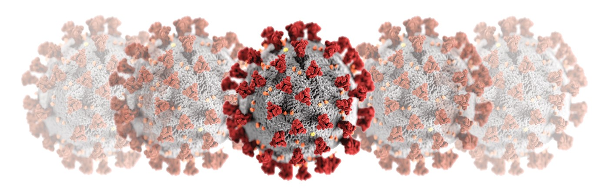

```{r setup, include=FALSE}
library(shiny)
library(shinyjs)
library(plotly)
library(R0)
library(shinythemes)
library(matrixStats)
library(tidyverse)
knitr::opts_chunk$set(echo = TRUE)
```
```{r, out.width = "100%", echo=FALSE}

```
_Note: The original version of this document was published on April 4, 2020, but the model and simulations have since evolved and the documentation and simulations have been updated accordingly._

### Obtaining estimates of COVID-19


#### Introduction

The Statistical Institute of Belize (SIB) explored producing estimates of the COVID-19 pandemic according to a methodology provided by the Pan American Health Organization (PAHO) and  recommended by the Belize Ministry of Health (MoH). This  has now been reviewed and updated after several engagements with members of the MoH, WHO and PAHO.

This methodology involved simulating a stochastic model of epidemic curves for different scenarios of outbreaks. The objective of the simulation was to produce estimates under different circumstances of the potential scope of the COVID-19 pandemic in the first two months after its introduction in Belize. These estimates would serve in informing and guiding health officials in better understanding the potential of the epidemic and plan for health services accordingly. 

#### Please visit our fully-featured [COVID SIMULATION SITE](https://sibbz.shinyapps.io/covidsim/)

#### Method

The outbreak was simulated in R Studio using the “R0”^[[R0 Package Documentation](https://cran.r-project.org/web/packages/R0/R0.pdf)]  ^[[R0 Package Academic Paper](https://bmcmedinformdecismak.biomedcentral.com/articles/10.1186/1472-6947-12-147)] package by Obidia et. al  (2015), which was developed in response to the H1N1 pandemic.  Management and maniuplation of the 1000 simulations was done using the “matrixStats”^[[matrixStats Package Documentation](https://cran.r-project.org/web/packages/matrixStats/matrixStats.pdf)]  package by Bengtsson et. al (2020).

The function ```sim.epid``` from the R0 package is the is the main utility for simulating the epidemic. Using specific parameters that describe the behaviour of the COVID-19 virus, this command simulates several epidemic curves that describe the spread (new daily cases) of the virus. The supplied parameters follow the documentation provided by the PAHO, but they may be modified in accordance to new developments, or for experimentation and general simulation purposes.


The command and its parameters are specified below as:

```{r eval=FALSE}
sim.epid(epid.nb=5, GT=generation.time("weibull",c(4.8, 2.3)), R0=2.5,
         epid.length=60, family="poisson", peak.value = NULL)
```

Where:

* __epid.nb__ - Is the number of outbreaks to be generated. It is equivalent to the number of imported cases. Each of the outbreaks will generate it's own epidemic curve. *(Note: This and the other parameters can be modified to update the simulation)*


```{r echo = FALSE}

numericInput("outbreaks", 
                          "", 
                          value = 5)
```

* __GT__ - The generation time distribution for the virus. This the time between the infection of a primary case and a secondary case. The PAHO recommends to use the time between the onset of clinical signs of the primary and secondary case as a proxy. Published GT parameters for a Weibull distribution for the serial interval of covid-19 are used as mean (sd) being 4.8 (2.3).  

```{r echo = FALSE}

numericInput("gt", 
                          "", 
                          value = 4.8)
```

* __R__ - The most important number in any epidemiological model is the **R0**, or the basic reproduction number. This represents how manny new persons each infected person would infect if the virus could move freely accross a population.  For example, an R0 of 2.5 means that each infected individual transmits COVID-19 to  2.5 more persons and so on. 
WHO initially estimated the R0 to be 2.0-2.5, some researchers suggest that it could be as high as 3. 

While **R0** is a constant number and an attribute of the virus in an ideal spreading environment, the actual spread of the virus is more accurately represented using the *effective reproductive number*, or **R**. The effective reproductive number takes into account the effect that social and health intervetions have on the spread of a virus. Interventions such as social distancing and lockdowns are being implemented in attempts to lower the **R**. 

Because **R0** remains constant but **R** may vary, this parameter in our simulation best represents **R** and should be modified in accordance to the level of intervention within a society. In other words, a simulation with a low R number implies heavy (quarantines, lockdowns, etc.) and effective interventions by the authorities.


```{r echo = FALSE}

sliderInput("r0", label = "",
              min = 1, max = 3.5, value = 2.5, step = 0.1)
```

* __epid.length__ -	The duration of the epidemic, the length of the epidemic curve as visualized on a graph. This was established by PAHO at 60 days, with daily simulation results. 

```{r echo = FALSE}

sliderInput("length", label = "",
              min = 20, max = 120, value = 60, step = 10)
```

* __family__ -	Distribution type for the new cases. As detailed by PAHO, a Poisson distribution is used to simulate daily incidence. This distribution was used to simulate the Daegu epidemic in South Korea (Korean Society for Infectious Diseases, 2020), in the scenario the mean and SD were very similar. Furthermore, other authors have used this distribution to model Covid-19 (Zhang et al., 2020). 
    + This study assumes that daily incidence obeys approximately Poisson distribution determined by daily infectiousness.
    + __There are debates__, however, that using a __*negative binomial*__ distribution for the number of secondary cases generated by a single primary case yields more precise results. This family of distribution can be specified using "negbin". 
    
```{r echo = FALSE}
radioButtons("family", "",
                          choices = list("poisson" = "poisson", "negbin" = "negbin"),
                          selected = "poisson",
                          inline = TRUE)
```

* __negbin.size__ - This is the over-dispersion parameter, if family is set to "negbin". The over-dispersion parameter  quantifies the variability in the number of secondary cases, and can be interpreted as a measure of the impact of superspreading events (the lower the value of k, the higher the impact of superspreading).

```{r echo = FALSE}
             numericInput("dispersion", 
                          "", 
                          value = 0.54)
```

* __peak.value__ -	Is the threshold value for incidence before the epidemic begins decreasing. 

#### Plot

```{r echo = FALSE}
    
  renderPlotly({
    
    
    length <- input$length
    outbreaks <- input$outbreaks
    dist <- "weibull"
    family <- input$family
    size <- input$dispersion
    R0 = input$r0
    gt <- input$gt
    
    #Initalize vectors that will hold accumulation from the 1000 simulations
    cumulativeAll <- numeric(7)
    cumuSeriousAll <- numeric(7)
    cumuCriticalAll <- numeric(7)
    simCasesAll <- numeric(length)
    
    
    #---Run 1000 simulations---#
    for (i in 1:1000)
    {
      if (family == "negbin"){
          sim <- sim.epid(epid.nb=outbreaks, GT=generation.time(dist,c(gt,2.3)), R0=R0, 
                          epid.length=length, family="negbin", negbin.size = size)
        } else if (family == "poisson"){
          sim <- sim.epid(epid.nb=outbreaks, GT=generation.time(dist,c(gt,2.3)), R0=R0, 
                          epid.length=length, family="poisson")
        }
  
      #2. Sum the rows to get the total daily cases accross all outbreaks (2)
      simCases <- rowSums(sim)
      #3. Save current simulation results
      simCasesAll <- c(simCasesAll, simCases)
      
      #---cumulative cases---#
    }
    
    
    #--POST SIMULATION Matrix Cleanup--#
    #   1. Merge simulation vectors into single matrices
    #   2. Remove 1st column in the new matrix, which was inialized with 0s before simulation.
    #   3. Derive row quartile information (across the 1000 columns from the 1000 simu.)
    
    #1. Turn simulation vectors into matrices
    simMatrix <- matrix(simCasesAll, nrow = length)
    
    #2. Remove 1st column (of zeros)
    simMatrix <- simMatrix[,2:1001]
    
    #3. Get quartile information for each matrix
    simQs <- rowQuantiles(simMatrix, na.rm = FALSE)
    
    #Get the median of the 1000 simulations
    simMedian <- simQs[,3]
    #Convert vector to data.frame so that it can be plotted with Plotly
    simDf <- data.frame(Days = seq(from = 1, to = length), NewCases = simMedian)
    
    #Plot with Ploltly
    plot_ly(data = simDf, x = ~Days, y = ~NewCases) %>% 
              config(modeBarButtonsToRemove = c("zoomIn2d", "zoomOut2d", "select2d", "pan2d", 
                                                "lasso2d", "zoom2d"), displaylogo = FALSE)
    
  })

```

The ```sim.epid``` command with the specified parameters is simulated 1000 times. The result of each simulation is stored in a matrix, with each column representing a different simulation (from 1:1000) and each row representing the daily number of new infections (with number of rows = epid.length). For each day (row), the median of the 1000 simulations was extracted using the ```row.quantiles``` function from the ```matrix.stats``` package. 

Given any number of COVID-19 infections, there are different probablities for the severity of each infection. The model results were broken down according to the expected severity where:

* __81%__ of the infected incidences are expected to be mild 
* __14%__ of the infected incidences are expected to be serious
* __5%__ of the infected incidences are expected to be critical

Based on the expected proportion of serious and critical cases, the number of hospital beds and ICU beds ecessary for the resultig number of hospitalized patients were estimated. This was calculated assuming that a serious case has a cumulative stay of 14 days and a critical case has a cumulative stay of 21 days.


```{r echo = FALSE}
    
  renderTable({
    
    
    length <- input$length
    outbreaks <- input$outbreaks
    dist <- "weibull"
    family <- input$family
    size <- input$dispersion
    R0 = input$r0
    gt <- input$gt
    intervalNum <- 8
    
    #Initalize vectors that will hold accumulation from the 1000 simulations
    cumulativeAll <- numeric(intervalNum)
    cumuSeriousAll <- numeric(intervalNum)
    cumuCriticalAll <- numeric(intervalNum)
    simCasesAll <- numeric(length)
    
    
    
     #---Run 1000 simulations---#
    for (i in 1:1000)
    {
      if (family == "negbin"){
          sim <- sim.epid(epid.nb=outbreaks, GT=generation.time(dist,c(gt,2.3)), R0=R0, 
                          epid.length=length, family="negbin", negbin.size = size)
        } else if (family == "poisson"){
          sim <- sim.epid(epid.nb=outbreaks, GT=generation.time(dist,c(gt,2.3)), R0=R0, 
                          epid.length=length, family="poisson")
        }
      
      #2. Sum the rows to get the total daily cases accross all outbreaks (2)
      simCases <- rowSums(sim)
      #3. Save current simulation results
      simCasesAll <- c(simCasesAll, simCases)
      
    }
    
    
    #--POST SIMULATION Matrix Cleanup--#
    #   1. Merge simulation vectors into single matrices
    #   2. Remove 1st column in the new matrix, which was inialized with 0s before simulation.
    #   3. Derive row quartile information (across the 1000 columns from the 1000 simu.)
    
    #1. Turn simulation vectors into matrices
    simMatrix <- matrix(simCasesAll, nrow = length)

    
    #2. Remove 1st column (of zeros)
    simMatrix <- simMatrix[,2:1001]

    #3. Get quartile information for each matrix
    simQs <- rowQuantiles(simMatrix, na.rm = FALSE)
    
    
    #Get the median of the 1000 simulations
    simMedian <- simQs[,3]
    
    #Convert vector to data.frame so that it can be plotted with Plotly
    simDf <- data.frame(Days = seq(from = 1, to = length), NewCases = simMedian)
    
    
    #---cumulative cases---#
    #   using 7-day intervals
    cumuQ2 <- round(c(sum(simMedian[1:7]), sum(simMedian[1:14]), sum(simMedian[1:21]), 
                      sum(simMedian[1:28]), sum(simMedian[1:35]), sum(simMedian[1:42]), 
                      sum(simMedian[1:49]), sum(simMedian[1:56])))
        
   
      #---Calculate Serious and Critical Cases---#
      #Serious cases:
      #   For this, we create 7-day intervals, starting at Day 7 to Day 49, where the number of
      #   serious cases at each of those intervals will be calculated and stored.
      #   Method: 
      #     1. At each of the interval, obtain the cummulative number of COVID cases in the
      #       last 14 days, since serious cases are only expected to last 14 days in terms of 
      #       hospital bed occupation. 
      #     2. Multiply cumulative number by 0.14, which is the probability that any given 
      #       case turns serious, and round up to the nearest whole.
      #Critical cases:
      #   Similar methodology as before with the following differences:
      #     1. Cumulative period is for 21 days instead of 14, as this is the average critical length in  
      #       terms of hospital bed occupation.
      #     2. The probability is 0.05 instead of 0.14
      
      #Hospital beds (Serious Cases)
    cumuSeriousPool <- c(sum(simMedian[1:7]), sum(simMedian[1:14]), sum(simMedian[8:21]), 
                         sum(simMedian[15:28]), sum(simMedian[22:35]), sum(simMedian[29:42]), 
                         sum(simMedian[36:49]), sum(simMedian[43:56]))
    cumuSerious <- ceiling(cumuSeriousPool * 0.14)
    
    #ICU beds (Critical Cases)
    cumuCriticalPool <- c(sum(simMedian[1:7]), sum(simMedian[1:14]), sum(simMedian[1:21]), 
                          sum(simMedian[8:28]),  sum(simMedian[15:35]), sum(simMedian[22:42]), 
                          sum(simMedian[29:49]), sum(simMedian[36:56]))
    cumuCritical <- ceiling(cumuCriticalPool * 0.05)
      
    #Calculate cumulative cases, hospital and ICU beds in 7-day intervalls
    dayInterval <- c(7,14,21,28,35,42,49,56)
    intervalCumulative <- cumuQ2
    intervalSerious <- cumuSerious
    intervalCritical <- cumuCritical
    intervalDailyCases <- simMedian[c(7,14,21,28,35,42,49,56)]
    
    simTable <- data.frame("Day" = dayInterval,
                           "CumulativeCases" = intervalCumulative,
                           "NewDailyCases" = intervalDailyCases,
                           "HospitalBedsInUse" = intervalSerious,
                           "ICUbedsInUse" = intervalCritical)
    
    simTable
    
  }, width = '100%', hover = TRUE)

```

#### Limitations

* The parameters may still be refined as the pandemic develops, and may change in different country settings. 
* Interventions by governments and authorities need to be considered when choosing an appropriate R number for the simulation.
* In the breakdown of cases by severity, differences are expected between countries according to the demographic distribution. These probability parameters cannot be currently manipulated in the interactive model (but may be adjusted in the written code).

### The Full Interactive Simulation

As the simulation project was fleshed out and refined in April, particularly after engagements with health officials and researchers in the MoH, WHO and PAHO, the simulation gained a life of its own. There  are now several components to the full simulation site (linked below):

1. The **Quick Simulation** page allows a user to quickly model the simulation of **one** epidemic curve by modifying the epidemic parameters. This page then:
  * Plots the daily incidence of new cases, with both poisson and negative binomial distribution curves.
  * Plots the cumulative severe (medium and critical severity) cases, with markers to indicate hospital capacity. 
  * Tabulates the cumulative severe cases resulting from both poisson and negative binomial simulations.
2. The **Full Simulation** page provides the ability to create a comprehensive simulation. The idea is to create localized simulations across different outbreaks in the country. Therefore,some epidemic parameters can be modified at the "national" level (epidemic length, epidemic generation time), and some at the local or "outbreak" level. The results of the simulation are then displayed using plots and tables, similar to the Quick Simulation page, but more detailed. This page allows the user to:
  * Enter up to 6 different outbreak scenarios.
  * Specify the R number for each outbreak. 
  * Specify the "start" date of each outbreak. 
  * If the outbreak is simulating a specific geographical or municipal area, then the number of hospital beds available can be specified. 
3. The **R Calculator** page uses the EpiEstim package along with user-uploaded COVID-19 daily incidence information to calculate the current effective reproductive number for the epidemic. Therefore, local data can be uploaded to obtain an accurate estimation of the current R number for COVID-19. 
4. A **Documentation** page where the resources that went into creating the simulation are credited. 


#### Please visit our fully-featured [COVID SIMULATION SITE](https://sibbz.shinyapps.io/covidsim/)


##### R simulation code

Note that this code demonstrates the basic functionality for running and outputting the epidemic simulation. This allows anybody interested to easily copy the code and modify or replicate it to obtain their own results. However, the actual code used in the fully-features COVID Simulation Site is much longer, given that it is an interactive and fleshed-out web application with many additional capabilities. The code for this web application will also be shared in the near future.
```{r eval = FALSE}
  
    #install.packages("R0")
    #install.packages("matrixStats")
    #install.packages("plotly")

    library(R0)
    library(matrixStats)
    library(plotly)
    
    #Initialize input variables for simulation
    #Note: In actual simulation, these are obtained from user inputs
    outbreaks <- 5
    dist <- "weibull"
    gt <- 4.8
    R0 <- 2.5
    family <- "poisson"
    size <- 0.54
    length <- 60
    
    #Initalize vector that will hold accumulation from the 1000 simulations
    simCasesAll <- numeric(length) 
    
    #---Run 1000 simulations---#
    #The result of each simulation will be appended to the simCasesAll vector. 
    #This vector will the be coverted to a matrix of 1000 colums and epid.length (60 in this case) rows.
    for (i in 1:1000)
    {
      sim <- sim.epid(epid.nb=outbreaks, GT=generation.time(dist,c(gt,2.3)), R0=R0, 
                      epid.length=length, family="poisson")
      
      #2. Sum the rows to get the total daily cases across all outbreaks (2)
      simCases <- rowSums(sim)
      #3. Save current simulation results
      simCasesAll <- c(simCasesAll, simCases)
      
    }
    
    
    #--POST SIMULATION Matrix Cleanup--#
    #   1. Merge simulation vectors into single matrix
    #   2. Remove 1st column in the new matrix, which was inialized with 0s before simulation.
    #   3. Derive row quantile information (across the 1000 columns from the 1000 simulations).
    
    #1. Turn simulation vectors into matrices
    simMatrix <- matrix(simCasesAll, nrow = length)
    
    #2. Remove 1st column (of zeros, as initialized with the numeric(length) function)
    simMatrix <- simMatrix[,2:1001]
    
    #3. Get quantile information 
    simQs <- rowQuantiles(simMatrix, na.rm = FALSE)
    
    
    #Get the median of the 1000 simulations
    simMedian <- simQs[,3]
    
    #Convert vector to data.frame so that it can be plotted with Plotly
    simDf <- data.frame(Days = seq(from = 1, to = length), NewCases = simMedian)
    
    #Plot with Ploltly
    plot_ly(data = simDf, x = ~Days, y = ~NewCases) %>% 
      config(modeBarButtonsToRemove = c("zoomIn2d", "zoomOut2d", "select2d", "pan2d", 
                                        "lasso2d", "zoom2d"), displaylogo = FALSE)
    
           
      #---Calculate and Tabulate Serious and Critical Cases---#
      #Serious cases:
      #   For this, we create 7-day intervals, starting at Day 7 to Day 49, where the number of
      #   serious cases at each of those intervals will be calculated and stored.
      #   Method: 
      #     1. At each interval, obtain the cumulative number of COVID cases in the
      #       last 14 days, since serious cases are only expected to last 14 days in terms of 
      #       hospital bed occupation. 
      #     2. Multiply cumulative number by 0.14, which is the probability that any given 
      #       case turns serious, and round up to the nearest whole.
      #Critical cases:
      #   Similar methodology as before with the following differences:
      #     1. Cumulative period is for 21 days instead of 14, as this is the average expected length of  
      #        hospital bed (ICU) occupation.
      #     2. The probability is 0.05 instead of 0.14.
      

    
     #---cumulative cases---#
     #  using 7-day intervals
    cumulativeCases <- round(c(sum(simMedian[1:7]), sum(simMedian[1:14]), sum(simMedian[1:21]), 
                      sum(simMedian[1:28]), sum(simMedian[1:35]), sum(simMedian[1:42]), 
                      sum(simMedian[1:49]), sum(simMedian[1:56])))
        
    #Hospital beds (Serious Cases)
    cumuSeriousPool <- c(sum(simMedian[1:7]), sum(simMedian[1:14]), sum(simMedian[8:21]), 
                         sum(simMedian[15:28]), sum(simMedian[22:35]), sum(simMedian[29:42]), 
                         sum(simMedian[36:49]), sum(simMedian[43:56]))
    cumuSerious <- ceiling(cumuSeriousPool * 0.14)
    
    #ICU beds (Critical Cases)
    cumuCriticalPool <- c(sum(simMedian[1:7]), sum(simMedian[1:14]), sum(simMedian[1:21]), 
                          sum(simMedian[8:28]),  sum(simMedian[15:35]), sum(simMedian[22:42]), 
                          sum(simMedian[29:49]), sum(simMedian[36:56]))
    cumuCritical <- ceiling(cumuCriticalPool * 0.05)
      
    #Calculate cumulative cases, hospital and ICU beds in 7-day intervals
    dayInterval <- c(7,14,21,28,35,42,49,56)
    intervalCumulative <- cumulativeCases
    intervalSerious <- cumuSerious
    intervalCritical <- cumuCritical
    intervalDailyCases <- simMedian[c(7,14,21,28,35,42,49,56)]
    
    simTable <- data.frame("Day" = dayInterval,
                           "CumulativeCases" = intervalCumulative,
                           "NewDailyCases" = intervalDailyCases,
                           "HospitalBedsInUse" = intervalSerious,
                           "ICUbedsInUse" = intervalCritical)
    
    view(simTable)

```
